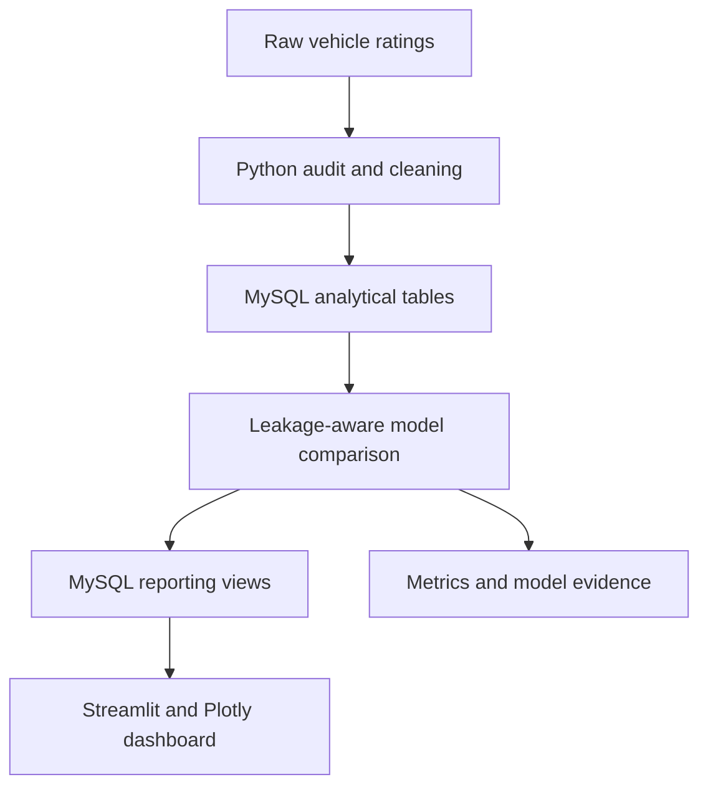
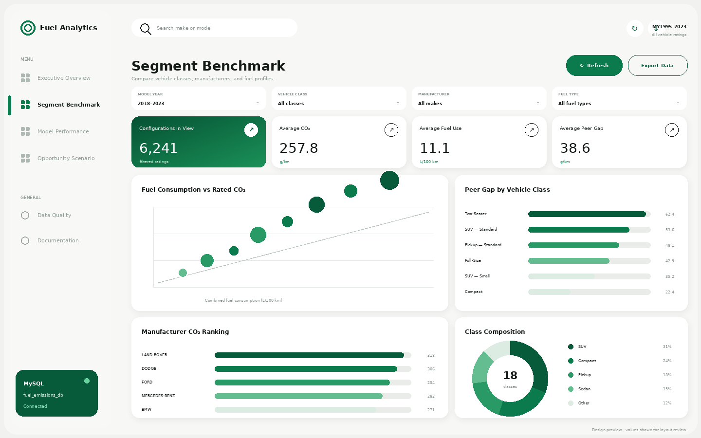
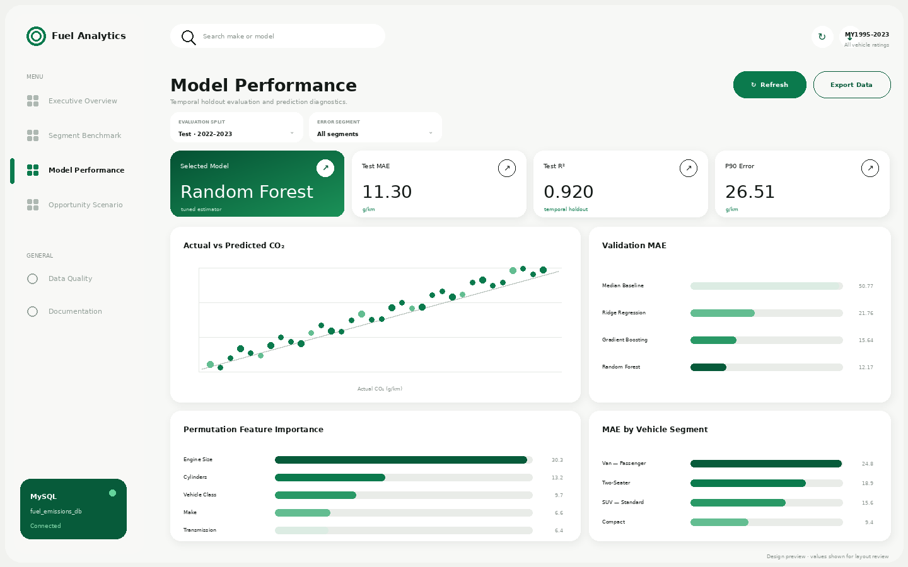
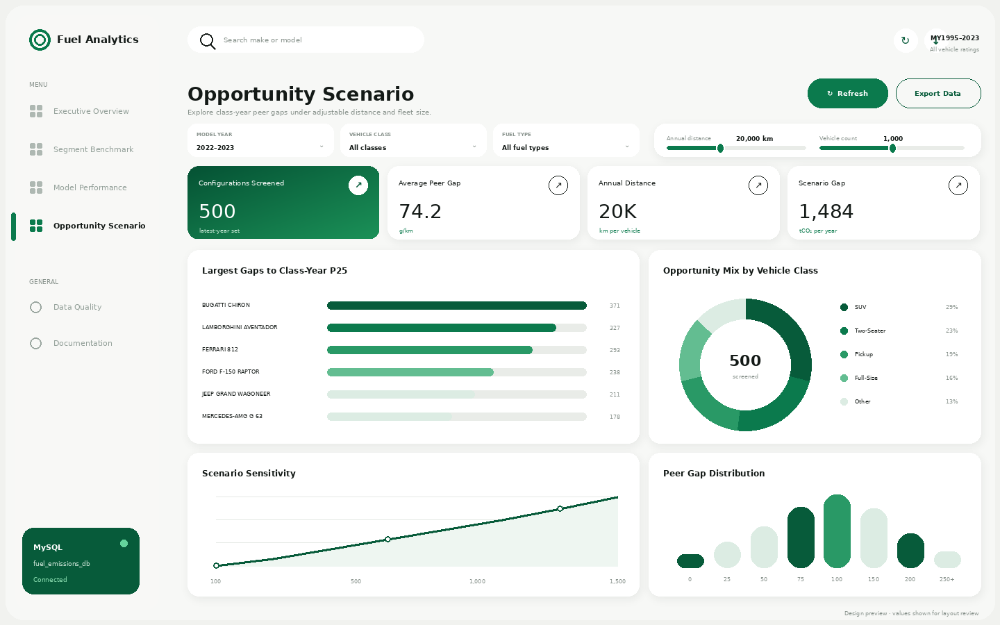

# Fuel Consumption & Emissions Analytics

An end-to-end portfolio project for analyzing Canadian vehicle fuel-consumption
ratings and modeling rated tailpipe CO₂ emissions with **Python, MySQL, Streamlit,
and Plotly**.

I built this project to practice a complete analytics workflow: auditing a raw
dataset, creating a reproducible cleaning pipeline, designing a relational reporting
layer, comparing leakage-aware regression models, and presenting the findings in an
interactive dashboard.

> This repository starts as a source-only package. The raw CSV, processed data,
> model artifact, metrics, and dashboard screenshots are created or added locally
> after the project is run. The included dashboard mockups are design references,
> not generated project results.

## Business Questions

- How have rated fuel consumption and tailpipe CO₂ changed across model years?
- Which vehicle classes, manufacturers, and fuel types have the highest averages?
- Which configurations sit furthest above their class-year peer benchmark?
- How accurately can rated CO₂ be estimated before measured fuel-consumption fields are used?
- In which test-period segments does the selected model produce the largest errors?

## Dataset

The pipeline expects the following file:

```text
data/raw/MY1995-2023-Fuel-Consumption-Ratings.csv
```

The supplied source contains 27,001 vehicle-rating rows and 15 columns covering
model years 1995–2023. Three exact duplicates are removed during cleaning, leaving
26,998 standardized records. The raw dataset is intentionally excluded from GitHub.

See [`docs/DATA_AUDIT.md`](docs/DATA_AUDIT.md) for the source schema, missing-value
assessment, duplicate handling, outlier policy, and analytical limitations.

## Project Workflow



## Repository Structure

```text
fuel-consumption-emissions-analytics/
├── .streamlit/
│   └── config.toml
├── dashboard/
│   ├── app.py
│   ├── data_access.py
│   ├── STREAMLIT_DASHBOARD_GUIDE.md
│   ├── mockups/
│   └── screenshots/
├── data/
│   ├── raw/
│   ├── processed/
│   └── outputs/
├── docs/
├── models/
├── sql/
│   ├── 01_schema.sql
│   ├── 02_reporting_views.sql
│   └── 03_business_analysis.sql
├── src/
│   ├── 01_audit_clean.py
│   ├── 02_train_models.py
│   ├── 03_load_mysql.py
│   ├── 04_build_dashboard_views.py
│   ├── 05_export_results.py
│   └── 06_validate_outputs.py
├── .env.example
├── .gitignore
├── requirements.txt
└── run_pipeline.py
```

## Tools

- **Python:** pandas, NumPy, scikit-learn, joblib
- **Database:** MySQL 8.0+, SQLAlchemy, PyMySQL
- **Dashboard:** Streamlit and Plotly
- **Validation:** automated file, model-reproduction, table, and view checks

I selected Streamlit because it keeps the dashboard in Python, connects cleanly to
the MySQL reporting layer, and makes the project straightforward to reproduce.

## Setup

### 1. Create a virtual environment

```bash
python -m venv .venv
```

Activate it:

```bash
# Windows PowerShell
.venv\Scripts\Activate.ps1

# macOS / Linux
source .venv/bin/activate
```

### 2. Install dependencies

```bash
python -m pip install --upgrade pip
pip install -r requirements.txt
```

### 3. Configure MySQL

Make sure MySQL 8.0 or newer is running. Copy the environment template:

```bash
# Windows PowerShell
Copy-Item .env.example .env

# macOS / Linux
cp .env.example .env
```

Update `.env` with your local credentials:

```env
MYSQL_HOST=localhost
MYSQL_PORT=3306
MYSQL_DATABASE=fuel_emissions_db
MYSQL_USER=root
MYSQL_PASSWORD=YOUR_PASSWORD
```

The configured account must be able to create the database and its tables.

### 4. Add the raw CSV

Place the source file at:

```text
data/raw/MY1995-2023-Fuel-Consumption-Ratings.csv
```

Do not rename the file unless you also update `RAW_FILE` in `src/config.py`.

## Run the Complete Pipeline

From the project root:

```bash
python run_pipeline.py
```

The command runs six stages in order:

1. audit and clean the raw CSV;
2. create and load the MySQL schema;
3. train, select, and evaluate regression models;
4. create MySQL reporting views;
5. export compact result evidence;
6. validate generated files, model reproduction, tables, and views.

A successful run ends with a validation report whose status is `PASS`.

## Launch the Dashboard

```bash
streamlit run dashboard/app.py
```

Run that command from the project root so Streamlit loads the pinned light theme
from `.streamlit/config.toml`. If the dashboard was already open before a theme or
source update, stop it with `Ctrl+C` and start it again instead of only refreshing
the browser tab.

The dashboard queries MySQL directly and contains four pages:

- **Executive Overview:** four KPIs plus CO₂ trend, fuel mix, vehicle-class, and engine-band charts;
- **Segment Benchmark:** fuel-versus-CO₂ scatter, peer-gap bars, manufacturer ranking, and class mix;
- **Model Performance:** actual-versus-predicted values, validation MAE, feature importance, and segment errors;
- **Opportunity Scenario:** largest peer gaps, opportunity mix, scenario sensitivity, and gap distribution.

The scenario page is a screening benchmark, not a claim of achieved emissions savings.

## Dashboard Design Preview

These approved mockups document the intended layout and visual hierarchy. The
numbers shown in them are only layout samples; after the pipeline is run, the
Streamlit dashboard reads the actual values from MySQL.

### Executive Overview


### Segment Benchmark



### Model Performance



### Opportunity Scenario



## Modeling Approach

The target is published rated tailpipe CO₂ in grams per kilometre. To test temporal
generalization, model years are split as follows:

| Split | Model years | Purpose |
|---|---:|---|
| Train | 1995–2019 | candidate fitting and Random Forest tuning |
| Validation | 2020–2021 | model selection by MAE, with RMSE as tie-breaker |
| Test | 2022–2023 | final untouched temporal evaluation |

The primary candidates are a median baseline, Ridge Regression, Histogram Gradient
Boosting, and a tuned Random Forest. The final estimator is serialized only after the
pipeline selects it from validation results.

Measured city, highway, and combined fuel consumption, combined MPG, ratings, and
target-derived peer fields are excluded from the primary model. Those fields are
too close to the target for the intended early-specification use case and would
create a circular result.

## Generated Evidence

After a successful run, review and commit these generated artifacts:

- `data/processed/vehicle_ratings_clean.csv`
- `data/outputs/data_audit_report.json`
- `data/outputs/model_metadata.json`
- `data/outputs/model_metrics.csv`
- `data/outputs/model_predictions.csv`
- `data/outputs/feature_importance.csv`
- `data/outputs/dashboard_kpis.csv`
- `data/outputs/validation_report.json`
- `models/selected_co2_model.joblib`
- `dashboard/screenshots/*.png` after capturing the running dashboard

The `.gitignore` excludes raw data, credentials, virtual environments, and caches.
Processed results, model artifacts, and screenshots are deliberately not ignored so
they can serve as reproducible evidence after I have reviewed the run.

## Result Interpretation

The generated metrics should be read from `data/outputs/model_metrics.csv` and
`data/outputs/model_metadata.json`. I report MAE as the primary metric because its
unit is directly interpretable in g/km, with RMSE, MAPE, R², mean error, and P90
absolute error providing additional context.

Feature importance is predictive rather than causal. Manufacturer effects may
reflect product mix, regulation, and historical coverage rather than engineering quality.

## Scope and Limitations

This project supports descriptive portfolio analysis, class-year peer screening,
and temporal evaluation of rated CO₂ predictions. It does not support:

- sales-weighted or fleet-weighted market conclusions;
- real-world fuel use or lifecycle-emissions claims;
- guaranteed savings or causal manufacturer comparisons;
- regulatory, safety, credit, or procurement decisions;
- production deployment without newer data and monitoring.

## GitHub Publishing Checklist

- [ ] `python run_pipeline.py` finishes with `PASS`
- [ ] dashboard opens without a MySQL error
- [ ] all four dashboard pages have been reviewed
- [ ] screenshots have been added to `dashboard/screenshots/`
- [ ] `.env` and raw data are absent from `git status`
- [ ] generated outputs and the selected model are present in `git status`
- [ ] result claims match the generated metrics
