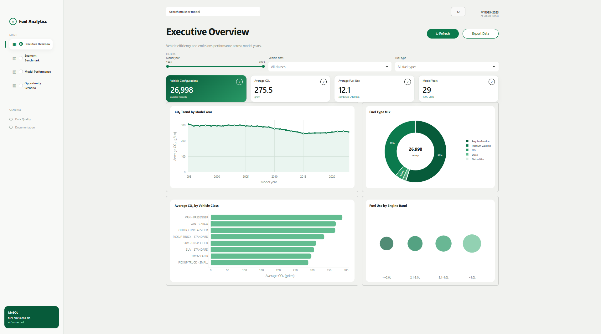
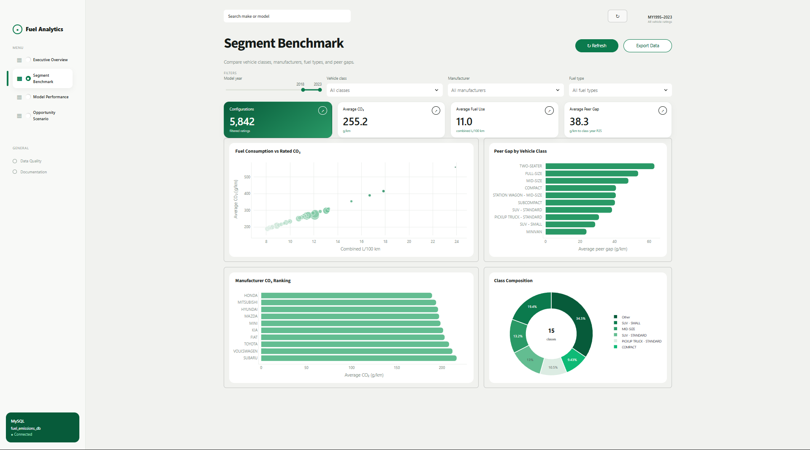
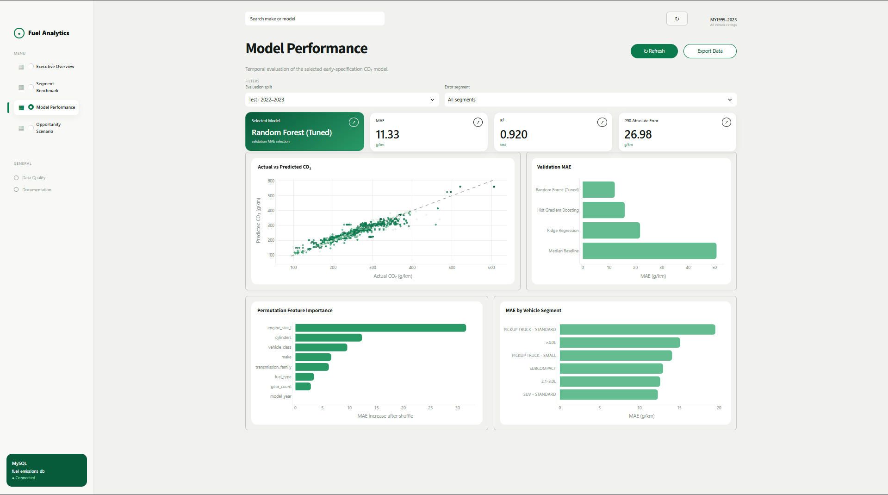
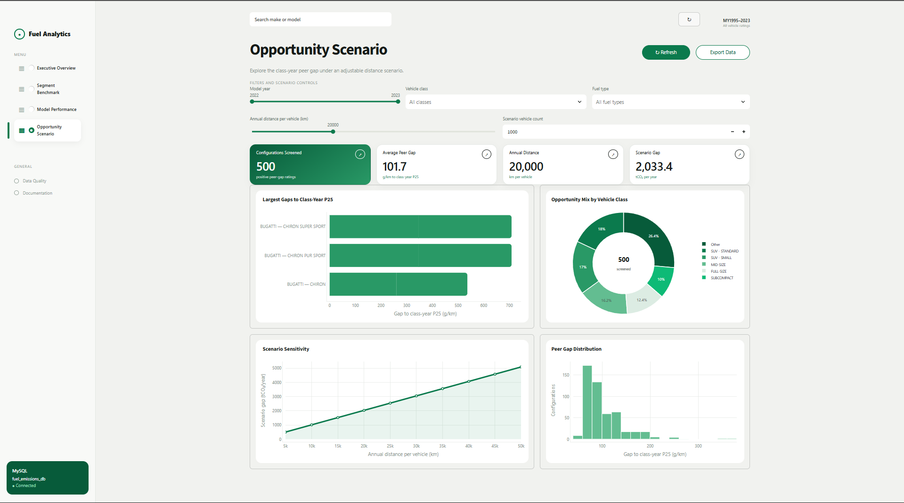
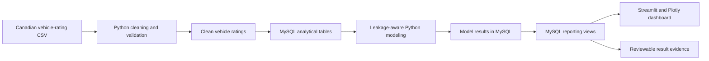

# Fuel Consumption & Emissions Analytics

Built this project to analyze Canadian vehicle fuel-consumption ratings and turn them into practical fuel-efficiency and emissions-benchmarking insights. Leveraged ChatGPT (SOL 5.6) as an AI co-pilot to accelerate the entire development lifecycle from data exploration and SQL query optimization in MySQL, to feature engineering and machine learning modeling, all the way to building an interactive Streamlit dashboard with Plotly visualizations. The project combines Python, MySQL, SQL, machine learning, Streamlit, and Plotly into one fully reproducible, end-to-end workflow.

**Author:** Rafi Adabhi Sunarya  
**Project title:** Fuel Consumption & Emissions Analytics 
**Dataset:** Government of Canada Fuel Consumption Ratings, model years 1995–2023

> This project estimates published rated tailpipe CO₂ emissions. It does not claim
> to estimate real-world fuel use, lifecycle emissions, sales-weighted fleet
> outcomes, or achieved emissions savings.

## What I built

- Cleaned and validated 27,001 raw vehicle-rating rows with Python, removing three
  exact duplicates and producing 26,998 standardized records.
- Standardized 29 model years of vehicle-class, fuel-type, and transmission-family
  labels, then created class-year CO₂ benchmarks and peer-gap features.
- Loaded the clean vehicle ratings and modeling outputs into MySQL for persistent
  analysis and reporting views.
- Used SQL aggregations, window functions, indexes, and reusable views for trend,
  segment, manufacturer, and class-year peer analysis.
- Developed a leakage-aware temporal CO₂ regression workflow with a tuned Random
  Forest selected on the 2020–2021 validation period.
- Created a MySQL-connected Streamlit and Plotly dashboard for executive trends,
  segment benchmarking, model diagnostics, and peer-gap screening.

## Dashboard showcase

The dashboard source is included in [`dashboard/`](dashboard/). Its four pages
answer different business questions:

1. **Executive Overview** — How have rated CO₂ emissions and fuel use changed
   across model years?
2. **Segment Benchmark** — Which vehicle classes, manufacturers, and fuel types
   have the highest averages and peer gaps?
3. **Model Performance** — How accurately does the selected model estimate rated
   CO₂ on the untouched test period?
4. **Opportunity Scenario** — Which configurations sit furthest above their
   class-year peer benchmark under an adjustable distance scenario?

### Executive Overview



### Segment Benchmark



### Model Performance



### Opportunity Scenario



The dashboard construction details are documented in:

- [`STREAMLIT_DASHBOARD_GUIDE.md`](dashboard/STREAMLIT_DASHBOARD_GUIDE.md) — page,
  filter, KPI, chart, and screenshot guidance.
- [`MODEL_CARD.md`](docs/MODEL_CARD.md) — prediction use case, leakage controls,
  validation design, and limitations.

## End-to-end workflow



MySQL is a required part of the workflow after cleaning. The Streamlit dashboard
queries MySQL reporting views directly; it does not fall back to a local CSV.

## Dataset and cleaning results

The source file contains Canadian fuel-consumption ratings from model years 1995 to
2023. I applied the following cleaning rules:

- removed three exact duplicate records;
- retained only records with valid year, engine, cylinder, fuel, and rated CO₂
  values;
- standardized vehicle classes, fuel types, and transmission families;
- retained the supplied ratings as published data rather than imputing target
  emissions;
- calculated class-year median and P25 CO₂ benchmarks for peer comparison.

| Metric | Result |
| --- | ---: |
| Raw vehicle-rating rows | 27,001 |
| Exact duplicates removed | 3 |
| Clean vehicle ratings | 26,998 |
| Model years | 29 |
| Coverage | 1995–2023 |
| Untouched test records | 1,758 |
| Regression target | Rated tailpipe CO₂ (g/km) |

The complete schema, audit checks, duplicate handling, and analytical limitations
are documented in [`docs/DATA_AUDIT.md`](docs/DATA_AUDIT.md).

## Modeling approach

### Leakage-aware CO₂ prediction

I used a temporal setup instead of a random split so that later vehicle ratings do
not leak into model selection:

| Component | Definition |
| --- | --- |
| Training period | 1995–2019, 23,295 records |
| Validation period | 2020–2021, 1,945 records |
| Untouched test period | 2022–2023, 1,758 records |
| Selection rule | Lowest validation MAE; RMSE used as tie-breaker |
| Selected model | Tuned Random Forest |

The primary candidates were a median baseline, Ridge Regression, Histogram Gradient
Boosting, and a tuned Random Forest. The selected model was refit on the 1995–2021
development period and evaluated once on the untouched 2022–2023 test set.

| Test metric | Result |
| --- | ---: |
| MAE | 11.30 g/km |
| RMSE | 18.28 g/km |
| MAPE | 4.33% |
| R² | 0.920 |
| P90 absolute error | 26.51 g/km |

Measured city, highway, and combined fuel-consumption fields; combined MPG;
ratings; and target-derived class-year benchmarks are excluded from the primary
model. They are too close to the target for the intended early-specification use
case and would create a circular result.

The measurement-rich diagnostic model is retained only to show why those fields are
not eligible for selection. Its near-perfect performance is not reported as the
project's primary result.

## Technology responsibilities

| Tool | How I used it |
| --- | --- |
| Python | CSV ingestion, cleaning, validation, feature preparation, model comparison, evaluation, and export |
| MySQL | Persistent vehicle, model-output, and reporting layer |
| SQL | Constraints, indexes, aggregations, window functions, class-year benchmarks, and dashboard views |
| Streamlit + Plotly | Four-page interactive dashboard for trends, benchmarking, diagnostics, and scenario screening |

## Repository structure

```text
fuel-consumption-emissions-analytics/
├── .streamlit/
│   └── config.toml             # tracked light dashboard theme
├── dashboard/
│   ├── app.py
│   ├── data_access.py
│   ├── mockups/
│   ├── screenshots/            # add reviewed screenshots after running
│   └── STREAMLIT_DASHBOARD_GUIDE.md
├── data/
│   ├── raw/                    # add the CSV locally
│   ├── processed/              # generated by Python
│   └── outputs/                # MySQL result evidence generated here
├── docs/
├── models/                     # generated selected model artifact
├── sql/
│   ├── 01_schema.sql
│   ├── 02_reporting_views.sql
│   └── 03_business_analysis.sql
├── src/
│   ├── 01_audit_clean.py
│   ├── 02_train_models.py
│   ├── 03_load_mysql.py
│   ├── 04_build_dashboard_views.py
│   ├── 05_export_results.py
│   ├── 06_validate_outputs.py
│   ├── config.py
│   └── db.py
├── .env.example
├── .gitignore
├── requirements.txt
└── run_pipeline.py
```

The numbered Python modules are the execution order. This source-only package does
not include the raw CSV, credentials, generated outputs, model binary, or dashboard
screenshots. After a successful run, the processed outputs, selected model, and
reviewed screenshots are intended to be committed as portfolio evidence.

## Run the project locally

### 1. Clone and create the environment

```powershell
git clone https://github.com/<your-username>/fuel-consumption-emissions-analytics.git
cd fuel-consumption-emissions-analytics

py -m venv .venv
Set-ExecutionPolicy -Scope Process -ExecutionPolicy Bypass
.\.venv\Scripts\Activate.ps1
python -m pip install --upgrade pip
pip install -r requirements.txt
```

### 2. Add the raw CSV

Download the Canadian Fuel Consumption Ratings CSV and save it as:

```text
data/raw/MY1995-2023-Fuel-Consumption-Ratings.csv
```

The raw source is excluded from GitHub. Do not rename it unless you also update
`RAW_FILE` in `src/config.py`.

### 3. Configure MySQL

Create a local `.env` file from the template:

```powershell
Copy-Item .env.example .env
```

Set the local MySQL credentials in `.env`:

```dotenv
MYSQL_HOST=localhost
MYSQL_PORT=3306
MYSQL_DATABASE=fuel_emissions_db
MYSQL_USER=root
MYSQL_PASSWORD=YOUR_ACTUAL_MYSQL_PASSWORD
```

The configured MySQL account needs permission to create a database and tables. The
pipeline creates `fuel_emissions_db` when absent, then rebuilds only this project's
tables and views; it does not modify other databases.

### 4. Run the complete pipeline

```powershell
python run_pipeline.py
```

The script runs these six stages:

```text
01_audit_clean
03_load_mysql
02_train_models
04_build_dashboard_views
05_export_results
06_validate_outputs
```

After a successful run, validation writes `data/outputs/validation_report.json`
with `"status": "PASS"`. The generated result evidence is exported from MySQL to
`data/outputs/`, and the selected estimator is saved as:

```text
models/selected_co2_model.joblib
```

### 5. Start the dashboard

```powershell
streamlit run dashboard/app.py
```

Run the command from the project root so Streamlit loads the tracked light theme in
`.streamlit/config.toml`. If you update dashboard source or theme files, stop the
running process with `Ctrl+C` and start it again instead of only refreshing the
browser tab.

## Useful MySQL validation

After the pipeline loads the database, I use this query in MySQL Workbench to
verify the main vehicle table:

```sql
SELECT
    COUNT(*) AS vehicle_records,
    COUNT(DISTINCT vehicle_id) AS unique_vehicle_ids,
    MIN(model_year) AS first_model_year,
    MAX(model_year) AS latest_model_year,
    AVG(co2_emissions_g_km) AS average_rated_co2_g_km
FROM vehicle_ratings;
```

The portfolio analysis queries are in
[`sql/03_business_analysis.sql`](sql/03_business_analysis.sql). They cover yearly
emissions trends, vehicle-class benchmarks, manufacturer comparisons, class-year
peer gaps, and test-period model diagnostics.

## GitHub data policy

I keep the repository reproducible without committing credentials or the raw source
file:

- tracked after review: source code, SQL, README, dashboard source, theme,
  mockups, documentation, processed results, model artifact, and dashboard
  screenshots;
- ignored: `.env`, virtual environments, raw CSV, caches, temporary files, and
  local database files.

The `.gitignore` deliberately keeps `data/processed/`, `data/outputs/`, `models/`,
and `dashboard/screenshots/` visible to Git after the pipeline has generated and I
have reviewed them.

## Limitations

- The analysis uses published Canadian vehicle ratings, not observed real-world fuel
  use or emissions.
- Manufacturer differences may reflect product mix, regulation, and historical
  dataset coverage rather than causal engineering quality.
- The dataset does not contain sales, vehicle distance, weight, power, drivetrain,
  or lifecycle-emissions information.
- The opportunity page is a class-year peer benchmark. It is not a forecast of
  realised savings or a procurement recommendation.
- The project is an offline portfolio analysis. It does not claim live,
  production-ready, or causal emissions impact.
